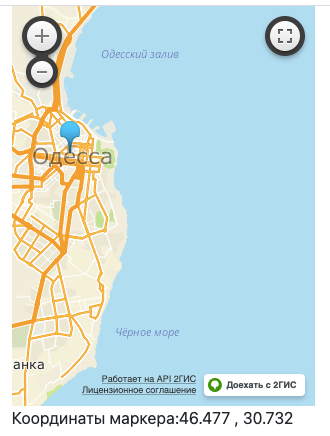
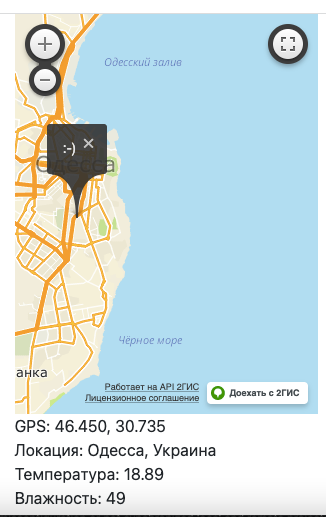

## ПОГОДНЫЙ ИНФОРМАТОР

* Локация выбирается на интерактивной карте от 2Gis (их скрипт "https://maps.api.2gis.ru/2.0/loader.js?pkg=full")
* Для получения данных о погоде используется API openweathermap.org
* Для получения дружественных названий локаций  - API googleapis
* (т.к. у Гугла апи платные, изначально не хотел использовать их карту)
* ну и все реквесты-респонсы обрабатывает Curl без вывода в браузер

#### Особенности реализации:
* все Апи-ключи спрятаны через обратимое преобраование (bin2hex->hex2bin), чтоб не торчать наружу в открытом виде, и не требовать отдельного канала передачи (типа .env- файлов)
* класс Weather имеет пару универсальных методов и даёт инфу о погоде
* класс GeoGoogle даёт user-friendly-название локации, наследуя Weather для переиспользования методов отправки запросов - получения ответов, но перекрывая метод формирования url'a и добавляя методы для локации 
* всё работает интерактивно , используя AJAX (для этого добавлена jquery https://ajax.googleapis.com/ajax/libs/jquery/3.6.0/jquery.min.js)

#### Перетащи маркер в нужно место, отслеживая GPS:

#### Щелкни по маркеру, и дождись ответа от серверов:
